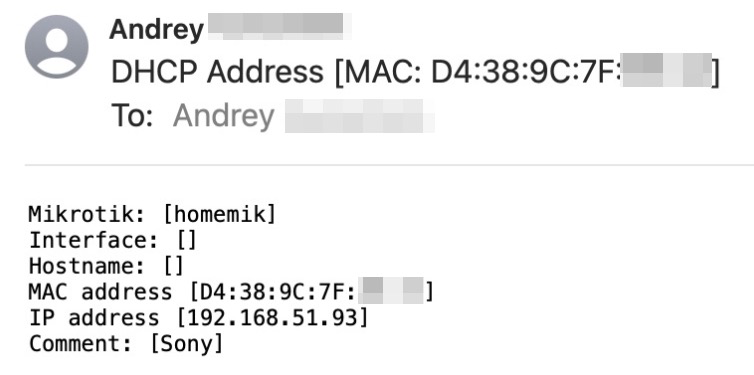

# Mikrotik DHCP notify to email
Скрипт отправляет уведомление на email при выдачи клиенту IP адреса на микротик.

Пример:




## Настройка почты
1. Создание пароля gmail. 
   Заходим в свой аккаунт gmail, переходим в Управление аккаунтом Google -> Безопасность -> Двухэтапная аутентификацияи -> Пароли приложений и создаем новый пароль. В названии можно указать Mikrotik.
  

2. Настраиваем параметры почты через терминал на mikrotik, MYUSER и MYPASS меняем на свои.

```bash
/tool/e-mail/set address=smtp.gmail.com from=MYUSER@gmail.com port=465 tls=yes user=MYUSER@gmail.com password=MYPASS
```

или через windbox


3. Отправляем тестовое письмо, можем сами себе.
   
   ```bash
   /tool/e-mail/send to=MYUSER@gmail.com subject="Test email from MIK" body="test body"
   ```

## Настройка скрипта
1. Через winbox открываем настройки нашего DHCP сервера, раздел Script
   
2. Копируем скрипт и сохраняем.

## Полезные ссылки
https://help.mikrotik.com/docs/display/ROS/E-mail
